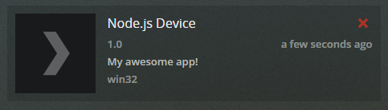

# plex-wrapper

A small module that makes it easier to use the Plex API for management.

## Usage

Installing the package
```bash
$ npm i plex-wrapper
```

### Getting started

First you need to require the package and then create an instance of the wrapper with the required parameters.
- **clientId**: A unique client identifier, you can generate a random one [here](https://www.guidgenerator.com/online-guid-generator.aspx). I do not recommend generating a new one every time you run it, as they will clutter up your authorized devices on your Plex.tv account.
- **username**: Your Plex.tv username.
- **password**: Your Plex.tv password.
-  **options** (`optional`): Customize the Plex Device under [authorized devices](https://app.plex.tv/desktop#!/settings/devices/all). 
    - **title**: The title of your application. Default `Node.js Device`.
    - **version**: The version of your application. Default `1.0`.
    - **description**: The description of your application. Default `My awesome app!`.
	- **operatingSystem**: The version of your application. Default `os.platform() ` which can return the [following](https://nodejs.org/api/os.html#os_os_platform).

**The image demonstrates the Plex Device if `options` are left to default:**


This example demonstrates how to create your first `PlexAPIClient` with and without custom `options`:
```js
var plexWrapper = require("plex-wrapper");

// With default options
var client = new plexWrapper.PlexAPIClient("clientId", "username", "password");

// With custom options
var customClient = new plexWrapper.PlexAPIClient(
    "clientId", 
    "username", 
    "password", 
    {
        title: 'My custom title!',
        version: '2.0',
        description: 'My custom description',
        operatingSystem: 'Windows 10'
    }
});
```

### .authenticate() `optional`

**Authenticate login with the supplied username and password**

It is possible to manually authenticate after the authentication has gone through you can then take advantage of the promise callback. All the functions built into this library will try to authenticate before performing any method, so this functionality is only for people that wants to have full control.

```js
var plexWrapper = require("plex-wrapper");
var client = new plexWrapper.PlexAPIClient("clientId", "username", "password");

client.authenticate().then(() => {
    // Perform any action that requires the client to be signed in
    client.getServers();
});
```

### .getServers()

**Return all servers associated with Plex account**

By default Plex API returns servers in XML format, this function converts it to JSON before returning. This function is also taking advantage of promise callbacks, which is demonstrated in the example:

```js
var plexWrapper = require("plex-wrapper");
var client = new plexWrapper.PlexAPIClient("clientId", "username", "password");

client.getServers().then(result => {
    // The result contains a JSON array with all the servers
    console.log(result);
});
```

### .inivteUser()

**Invite a given user to a specific Plex server under the account**

This function allows you to invite a user to a specific server, given you have their username/email and the machine identifier of your server. The target will receive an email with the invite.

- **username**: Can either be the email or username of the target user.
- **machineId**: The server's machine identifier, can be obtained using the `.getServers()` function. 

```js
var plexWrapper = require("plex-wrapper");
var client = new plexWrapper.PlexAPIClient("clientId", "username", "password");

client.inviteUser("username", "machineId");
```

### .getUsers(), .getPendingUsers() and .getAllUsers()

**Return all users with shared library access or pending access to any Plex library**

The Plex API splits up users that already accepted library sharing access and users that still got a pending invitation. It is also possible to get all usings, where it'll return the 2 different user types in one array. Like the `.getServers()` function this one also parses the XML to JSON before returning it. The example demonstrate how you get each type of user:

```js
var plexWrapper = require("plex-wrapper");
var client = new plexWrapper.PlexAPIClient("clientId", "username", "password");

client.getUsers().then(result => {
    // The result contains a JSON array with all the shared library users
    console.log(result);
});

client.getPendingUsers().then(result => {
    // The result contains a JSON array with all the pending shared library users
    console.log(result);
});

client.getAllUsers().then(result => {
    // The result contains a JSON array with both shared and pending shared users (Keep in mind that the properties may vary from the 2 types of user)
    console.log(result);
});
```

### .removeUser() and .removePendingUser()

**Removes a specific user from accessing any shared libraries**

Just like the get users, removing user is already separated based on if they have accepted the invite yet. To use this function you need to have a user's unique identifier.

- **userId**: A users unique identifier, can be obtained using the `.getUsers()` or `.getPendingUsers()` functions. 

```js
var plexWrapper = require("plex-wrapper");
var client = new plexWrapper.PlexAPIClient("clientId", "username", "password");

client.removeUser("userId");
client.removePendingUser("userId");
```

### .getSessions()

**Return all sessions running on a specific server**

This function allows you to fetch all active sessions on a specific server. Sessions contains information about who's watching something, including what they're watcihng and on which device. The function requires you to know the IP and port of the server you want to return the sessions of. This function parses it from XML to JSON.

- **ip**: The server's ip, can be obtained using the `.getServers()` function. 
- **port**: The server's port, can be obtained using the `.getServers()` function. 

This example demonstrates how to get all sessions from a specific server:
```js
var plexWrapper = require("plex-wrapper");
var client = new plexWrapper.PlexAPIClient("clientId", "username", "password");

client.getSessions("127.0.0.1", 32400).then(result => {
    // The result contains a JSON array with all the sessions
    console.log(result);
});
```

## License

MIT License

Copyright (c) 2019 Rasmus Buchholdt

Permission is hereby granted, free of charge, to any person obtaining a copy
of this software and associated documentation files (the "Software"), to deal
in the Software without restriction, including without limitation the rights
to use, copy, modify, merge, publish, distribute, sublicense, and/or sell
copies of the Software, and to permit persons to whom the Software is
furnished to do so, subject to the following conditions:

The above copyright notice and this permission notice shall be included in all
copies or substantial portions of the Software.

THE SOFTWARE IS PROVIDED "AS IS", WITHOUT WARRANTY OF ANY KIND, EXPRESS OR
IMPLIED, INCLUDING BUT NOT LIMITED TO THE WARRANTIES OF MERCHANTABILITY,
FITNESS FOR A PARTICULAR PURPOSE AND NONINFRINGEMENT. IN NO EVENT SHALL THE
AUTHORS OR COPYRIGHT HOLDERS BE LIABLE FOR ANY CLAIM, DAMAGES OR OTHER
LIABILITY, WHETHER IN AN ACTION OF CONTRACT, TORT OR OTHERWISE, ARISING FROM,
OUT OF OR IN CONNECTION WITH THE SOFTWARE OR THE USE OR OTHER DEALINGS IN THE
SOFTWARE.